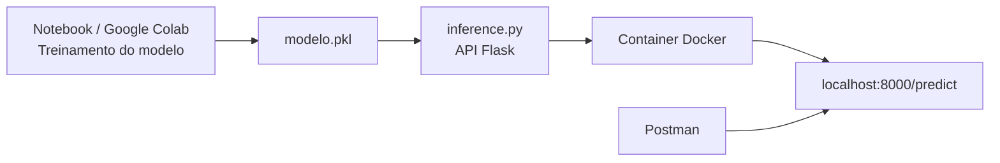
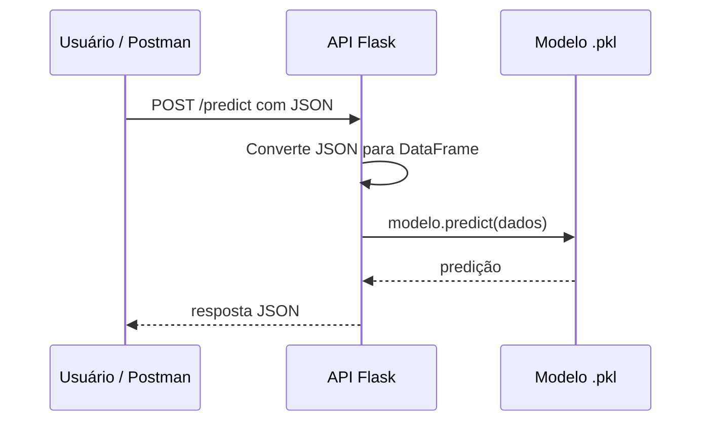

# Deploy de Modelo de Machine Learning com Flask e Docker


## Visão geral

Neste roteiro prático, vamos transformar um modelo de Machine Learning treinado em Python em um serviço acessível por HTTP.

A ideia é sair de um modelo treinado em um notebook, como o Google Colab, e criar uma pequena API capaz de receber dados e devolver previsões. Em seguida, essa aplicação será empacotada em um container Docker para execução de forma isolada e reproduzível.

Esse processo representa um passo importante na transição entre experimentação em notebooks e aplicações reais baseadas em serviços.

---

## Tabela de conteúdos

- [Objetivos da atividade](#objetivos-da-atividade)
- [Pré-requisitos](#pré-requisitos)
- [Arquitetura da solução](#arquitetura-da-solução)
- [Estrutura do projeto](#estrutura-do-projeto)
- [Etapa 1 — Salvar o modelo treinado](#etapa-1--salvar-o-modelo-treinado)
- [Etapa 2 — Criar o arquivo `inference.py`](#etapa-2--criar-o-arquivo-inferencepy)
- [Etapa 3 — Criar o arquivo `requirements.txt`](#etapa-3--criar-o-arquivo-requirementstxt)
- [Etapa 4 — Executar a aplicação localmente](#etapa-4--executar-a-aplicação-localmente)
- [Etapa 5 — Testar a API no Postman](#etapa-5--testar-a-api-no-postman)
- [Etapa 6 — Criar o `Dockerfile`](#etapa-6--criar-o-dockerfile)
- [Etapa 7 — Construir a imagem Docker](#etapa-7--construir-a-imagem-docker)
- [Etapa 8 — Executar o container](#etapa-8--executar-o-container)
- [Etapa 9 — Testar novamente no Postman](#etapa-9--testar-novamente-no-postman)
- [Fluxo completo](#fluxo-completo)
- [Referências](#referências)

---

## Objetivos da atividade

Ao final desta prática, você será capaz de:

- salvar um modelo treinado em arquivo `.pkl`
- criar uma API simples em Python utilizando Flask
- carregar um modelo salvo dentro da API
- enviar dados para o modelo via requisição HTTP
- receber previsões em formato JSON
- empacotar a aplicação em um container Docker
- testar a API utilizando Postman

---

## Pré-requisitos

Antes de iniciar, verifique se você possui:

- Python instalado
- Docker Desktop instalado e em execução
- um editor de código, como VS Code
- Postman instalado
- um modelo de Machine Learning já treinado

> [!IMPORTANT]
> Antes de testar com Docker, confirme que o **Docker Desktop está aberto e em execução**. Caso contrário, o build e a execução do container falharão.

> [!TIP]
> Para evitar problemas com comandos e aspas no Windows, pode ser mais confortável usar **Git Bash** ou o terminal integrado do **VS Code**.

---

## Arquitetura da solução

### Diagrama arquitetural



### Fluxo da inferência



> [!NOTE]
> O modelo não é treinado durante a execução da API. Ele já deve estar pronto e salvo em arquivo para apenas ser carregado e utilizado nas previsões.

---

## Estrutura do projeto

Crie uma pasta para o projeto com a seguinte estrutura:

```text
deploy_ml/
├── modelo.pkl
├── inference.py
├── requirements.txt
└── Dockerfile
```

---

## Etapa 1 — Salvar o modelo treinado

Após treinar um modelo de Machine Learning em Python, é necessário salvá-lo em um arquivo para que ele possa ser reutilizado posteriormente.

Um formato comum para isso é o **pickle** (`.pkl`).

Exemplo:

```python
import pickle

with open("modelo.pkl", "wb") as f:
    pickle.dump(modelo, f)
```

Isso permite reutilizar o modelo posteriormente sem precisar treiná-lo novamente.

> [!TIP]
> Guarde o arquivo `modelo.pkl` na mesma pasta da API durante esta prática. Isso simplifica a leitura do arquivo no código.

---

## Etapa 2 — Criar o arquivo `inference.py`

1. Abra o VS Code ou outro editor de código.
2. Dentro da pasta do projeto, crie um novo arquivo chamado:

```text
inference.py
```

3. Cole o código abaixo:

```python
from flask import Flask, request, jsonify
import pickle
import pandas as pd

with open("modelo.pkl", "rb") as f:
    modelo = pickle.load(f)

app = Flask(__name__)

@app.route("/predict", methods=["POST"])
def predict():
    dados = request.json
    df = pd.DataFrame(dados)
    pred = modelo.predict(df)

    return jsonify({
        "predicao": pred.tolist()
    })

if __name__ == "__main__":
    app.run(host="0.0.0.0", port=8000)
```

> [!IMPORTANT]
> Os nomes das colunas enviadas no JSON devem corresponder às variáveis usadas no treinamento do modelo. Caso contrário, a predição pode falhar.

---

## Etapa 3 — Criar o arquivo `requirements.txt`

Crie um arquivo chamado:

```text
requirements.txt
```

Conteúdo:

```txt
flask
pandas
numpy
scikit-learn
```

---

## Etapa 4 — Executar a aplicação localmente

No terminal, dentro da pasta do projeto:

```bash
pip install -r requirements.txt
```

Depois execute:

```bash
python inference.py
```

Se tudo estiver correto, aparecerá algo semelhante a:

```text
Running on http://0.0.0.0:8000
```

---

## Etapa 5 — Testar a API no Postman

### Criar a requisição

1. Abra o **Postman**
2. Clique em **New**
3. Clique em **HTTP Request**

### Configurar a requisição

**Método**

```text
POST
```

**URL**

```text
http://localhost:8000/predict
```

### Configurar o Body

1. Clique na aba **Body**
2. Selecione **raw**
3. No seletor à direita escolha **JSON**

ATENÇÃO: 
O exemplo abaixo é referente ao exercício do dataset "diamonds". 
Customize o conteúdo do arquivo JSON com as features (dados de entrada X) do seu modelo.

Cole:

```json
[
  {
    "x": 1.2,
    "y": 3.4,
    "z": 5.6
  }
]
```

Clique em **Send**.

Resposta esperada:

```json
{
  "predicao": [0]
}
```

> [!TIP]
> Se a API estiver rodando, mas o Postman não retornar a predição, confira primeiro se o método está como **POST** e se o body está como **raw + JSON**.

---

## Etapa 6 — Criar o `Dockerfile`

Crie um arquivo chamado:

```text
Dockerfile
```

Conteúdo:

```dockerfile
FROM python:3.11-slim

WORKDIR /app

COPY requirements.txt .

RUN pip install --no-cache-dir -r requirements.txt

COPY . .

EXPOSE 8000

CMD ["python", "inference.py"]
```

---

## Etapa 7 — Construir a imagem Docker

No terminal:

```bash
docker build -t modelo .
```

Esse comando cria uma imagem Docker contendo toda a aplicação.

---

## Etapa 8 — Executar o container

```bash
docker run -p 8000:8000 modelo
```

Isso inicia o container e disponibiliza a aplicação na porta 8000.

> [!NOTE]
> A porta `8000:8000` indica que a porta 8000 do computador hospedeiro está sendo conectada à porta 8000 do container.

---

## Etapa 9 — Testar novamente no Postman

Com o container rodando, volte ao Postman e repita a requisição:

```text
POST http://localhost:8000/predict
```

Body:

```json
[
  {
    "x": 1.2,
    "y": 3.4,
    "z": 5.6
  }
]
```

Se tudo estiver correto, a API retornará novamente a predição.

---

## Fluxo completo

```text
Treinar modelo
      ↓
Salvar modelo (.pkl)
      ↓
Criar API Flask
      ↓
Testar localmente
      ↓
Criar imagem Docker
      ↓
Executar container
      ↓
Consumir API via HTTP
```

---

## Referências

- Flask Documentation: https://flask.palletsprojects.com/
- Scikit-learn — Model Persistence: https://scikit-learn.org/stable/model_persistence.html
- Docker Documentation: https://docs.docker.com/
- Postman Learning Center: https://learning.postman.com/
- Python Pickle Documentation: https://docs.python.org/3/library/pickle.html
